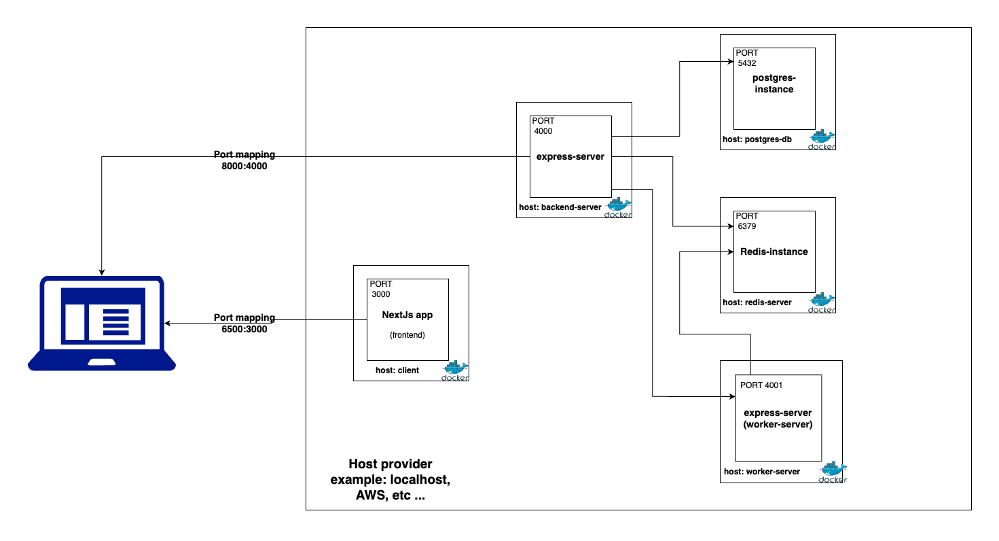
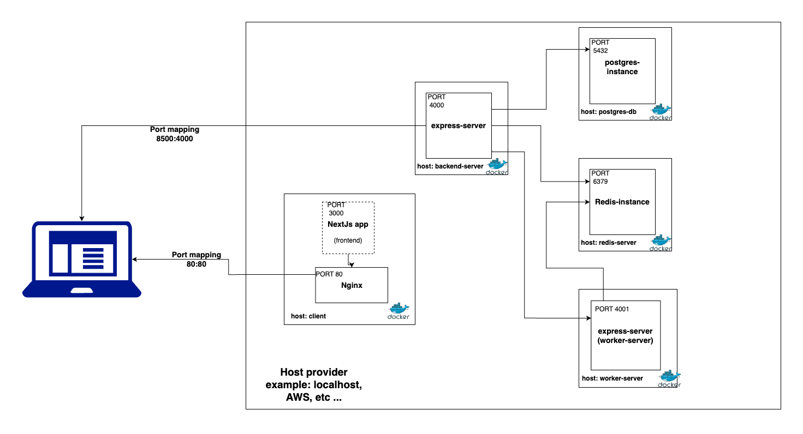

# Dockerized Node.js, Redis, PostgreSQL, Next.js, and Nginx Setup

This project aims to provide a Dockerized development and production environments for running multiple services including Node.js servers, Redis, PostgreSQL, Next.js, and Nginx server. The setup utilizes Docker and Docker Compose for containerization and orchestration.

The project functionalities doesn't require all of these services, but the purpose of the project is to
practice docker.

## Services included

1. Backend server (Nodejs-express)
2. Worker server (Nodejs-express)
3. Postgres-db
4. redis-server
5. client (Nextjs app)
6. Nginx server (to serve client in production environment)

## Development Diagram

## Production Diagram

## Run steps:

1. Clone the project.
1. Make sure that your machine has docker and docker-compost setup.
1. RUN `docker-compose up`
1. ping http://localhost on your browser.
